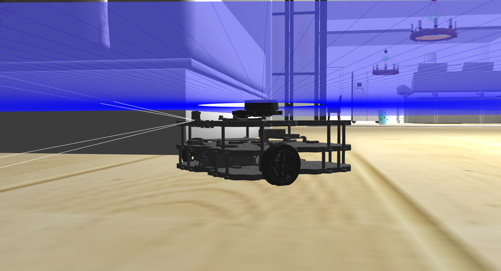

# 🤖 Language-Vision-Grounded-Robot-Autonomy

[](https://promzyadiole.github.io/Language-Vision-Grounded-Robot-Autonomy/demo/)

<p align="center">
  <strong><a href="https://promzyadiole.github.io/Language-Vision-Grounded-Robot-Autonomy/demo/">▶ Watch Demo Video</a></strong>
</p>

<p align="center">
  <strong>A full-stack robotics framework for language-guided navigation, semantic localization, multimodal perception, and ROS 2 robot control through a modern web command center.</strong>
</p>

<p align="center">
  
  
  
  
  
  
  
</p>

---

## 📌 Overview

**Language-Vision-Grounded-Robot-Autonomy** is a modular full-stack robotics system that connects **natural language**, **voice commands**, **vision-language perception**, **ROS 2 navigation**, and a **web-based robot command center** into one integrated framework.

The project combines:

- a **FastAPI backend** for intent handling, robot control, localization, perception services, and state management
- a **Next.js frontend** for chat, navigation, dashboard, control, and vision monitoring
- a **ROS 2 bridge** that connects web APIs to live robot topics, transforms, sensors, and Nav2 actions
- a **vision stack built around SAM + CLIP/OpenCLIP** for scene understanding, object detection, and annotated perception output
- a **YAML-grounded environment layer** for named places, waypoint routes, and motion primitives
- a **state memory layer** for current pose, previous pose, last command, last result, and scan summaries
- **browser speech input** for voice-driven robot interaction
- a **small-house world workflow** for semantic indoor navigation and room-level grounding

This repository is designed as both:

- a **research-engineering system** for language-grounded robot autonomy
- a **practical framework** that can be adapted to simulation or real ROS 2 robots

---

## ✨ Core Capabilities

### 🗣️ Natural Language Robot Commands

Users can issue robot commands such as:

```text
Go to the kitchen
Go to the dining room
What do you see?
Where are you?
What was my last command?
Move forward
Turn right
Stop
```

The system parses the instruction, maps it to grounded robot actions, executes through ROS 2, and returns structured feedback.

### 🎙️ Voice Command Support

The chat interface supports browser-based microphone input using the **Web Speech API**, allowing hands-free command entry directly from the UI.

### 👁️ Vision-Language Perception

The robot can:

- summarize the current scene
- list visible objects
- generate annotated image overlays
- provide left / center / right object hints
- answer perception-grounded language queries

### 🧭 Semantic Place Navigation

Named places are grounded through a YAML registry and mapped to robot poses for Nav2 execution.

Examples include:

- `entrance`
- `dining`
- `kitchen`
- `sitting_room`
- `gym_room`
- `bedroom`
- `study_room`
- `visitors_room`

### 🏠 Small-House World Integration

The project includes a **small-house world navigation workflow** with semantic room-level place definitions captured directly from AMCL-localized robot poses.

This enables:

- room-aware navigation
- reproducible semantic goal selection
- quick place-button navigation from the frontend
- YAML-driven extension of new rooms and destinations

### 🕹️ Manual Motion Control

The control page supports direct motion primitives such as:

- move forward
- move backward
- turn left
- turn right
- rotate
- stop

### 🧠 Robot State Memory

The backend maintains structured short-term robot memory including:

- current pose
- previous pose
- last command
- last result
- event history
- scan summary
- navigation state
- robot status snapshot

This lets the robot answer contextual questions instead of behaving like a stateless command dispatcher.

### 🌐 Full Web Command Center

The user interface includes dedicated pages for:

- Home
- Dashboard
- Vision
- Chat
- Navigation
- Control

---

## 🏗️ System Architecture

<p align="center">
  
</p>

### High-Level Flow

```text
User (Text / Voice / Buttons)
        ↓
Next.js Frontend
        ↓
FastAPI Backend
        ↓
Intent Parsing + Action Mapping + State Memory
        ↓
ROS2 Bridge + Vision Service + YAML Registry
        ↓
Nav2 / Topics / Sensors / Robot Execution
```

### Main Architectural Layers

The system is organized into four major layers. Each layer has a clear responsibility and communicates with the next layer through structured data, REST APIs, ROS 2 interfaces, or shared robot state.

#### 1. Interaction Layer

The interaction layer is the user-facing entry point of the system.

It provides:

- text chat commands
- speech-to-text input
- quick command buttons
- semantic navigation controls
- manual motion controls
- dashboard monitoring
- vision result visualization

#### 2. Language Layer

The language layer converts human instructions into structured robot intents.

Example user commands:

```text
Go to the kitchen
What do you see?
Where are you?
Move forward
Stop
```

Example parsed intents:

```text
NAVIGATE_TO_PLACE
FOLLOW_WAYPOINT_ROUTE
MOVE_FORWARD
TURN_LEFT
SCENE_SUMMARY
GET_POSE
GET_LAST_COMMAND
```

#### 3. Perception Layer

The perception layer connects the camera stream to multimodal understanding modules.

It supports:

- object detection
- scene summarization
- annotated image generation
- direction-aware object hints
- perception-grounded chat responses

#### 4. Execution Layer

The execution layer turns structured backend actions into ROS 2 execution.

It supports:

- Nav2 `NavigateToPose`
- waypoint following
- `/cmd_vel` control
- robot stop commands
- scan summaries
- AMCL pose queries
- camera-trigger workflows
- robot state updates

---

## 🧱 Tech Stack

### Robotics

- **ROS 2 Humble**
- **Nav2**
- **Gazebo**
- **AMCL**
- **TurtleBot3 Waffle Pi**

### Backend

- **FastAPI**
- **Python**
- **Pydantic**
- **Uvicorn**

### Frontend

- **Next.js**
- **TypeScript**
- **React**
- **Tailwind CSS**

### Vision / Multimodal AI

- **Segment Anything Model**
- **CLIP / OpenCLIP**
- **OpenCV**
- **NumPy**
- **PyTorch**

### Interaction

- **Web Speech API**
- **REST APIs**
- **Typed JSON request / response flow**

### Grounding and State

- **YAML action registry**
- **YAML place registry**
- **State memory store**
- **Pose history**
- **Event history**

---

## 🏠 Small-House Semantic Navigation

The project includes a semantic small-house navigation configuration grounded from AMCL-localized robot poses.

### Current Small-House Places

| Place | x | y | Orientation |
|---|---:|---:|---|
| Dining | `8.942` | `0.018` | `qz=-0.524, qw=0.852` |
| Kitchen | `10.945` | `-2.037` | `qz=-0.099, qw=0.995` |
| Sitting Room | `4.585` | `-1.732` | `qz=-0.835, qw=0.550` |
| Gym Room | `5.363` | `1.752` | `qz=0.112, qw=0.994` |
| Bedroom | `-2.567` | `-0.789` | `qz=0.801, qw=0.598` |
| Study Room | `-3.940` | `-0.185` | `qz=0.945, qw=0.327` |
| Visitors Room | `-3.075` | `-3.774` | `qz=0.671, qw=0.742` |

### Small-House Demo Assets

| Asset | Path |
|---|---|
| Demo video | `docs/demo/videos/My_Robot_small_house_demo.mp4` |
| Small-house navigation page preview | `docs/images/ui-navigation-page.png` |
| Gazebo world preview | `docs/images/robot-gazebo-overview.png` |
| RViz preview | `docs/images/robot-rviz-overview.png` |

---

## 📂 Project Structure

```text
Language-Vision-Grounded-Robot-Autonomy/
├── backend/
│   ├── app/
│   │   ├── main.py
│   │   ├── api/
│   │   │   └── routes/
│   │   │       ├── chat.py
│   │   │       ├── localization.py
│   │   │       ├── memory.py
│   │   │       ├── navigation.py
│   │   │       ├── robot.py
│   │   │       ├── system.py
│   │   │       └── vision.py
│   │   ├── core/
│   │   │   ├── config.py
│   │   │   └── dependencies.py
│   │   ├── models/
│   │   │   └── schemas.py
│   │   ├── services/
│   │   │   ├── action_mapper.py
│   │   │   ├── intent_parser.py
│   │   │   ├── llm_service.py
│   │   │   ├── ros2_bridge.py
│   │   │   ├── sam_clip_perceptor.py
│   │   │   ├── state_store.py
│   │   │   ├── vision_service.py
│   │   │   └── yaml_registry.py
│   │   └── data/
│   │       ├── robot_actions.yaml
│   │       └── vision_labels.yaml
│   └── requirements.txt
│
├── frontend/
│   ├── public/
│   ├── src/
│   │   ├── app/
│   │   │   ├── chat/
│   │   │   ├── control/
│   │   │   ├── dashboard/
│   │   │   ├── navigation/
│   │   │   ├── vision/
│   │   │   ├── globals.css
│   │   │   ├── layout.tsx
│   │   │   └── page.tsx
│   │   ├── components/
│   │   │   ├── chat-panel.tsx
│   │   │   ├── command-buttons.tsx
│   │   │   ├── sidebar.tsx
│   │   │   ├── status-card.tsx
│   │   │   ├── topbar.tsx
│   │   │   └── vision-panel.tsx
│   │   └── lib/
│   │       └── api.ts
│   ├── package.json
│   └── next.config.ts
│
├── docs/
│   ├── demo/
│   │   ├── index.html
│   │   ├── images/
│   │   └── videos/
│   │       └── My_Robot_small_house_demo.mp4
│   └── images/
│       ├── hero-ui-overview.png
│       ├── architecture-overview.png
│       ├── ui-home-page.png
│       ├── ui-dashboard-page.png
│       ├── ui-vision-page.png
│       ├── ui-chat-page.png
│       ├── ui-navigation-page.png
│       ├── ui-control-page.png
│       ├── robot-gazebo-overview.png
│       ├── robot-rviz-overview.png
│       ├── robot-annotated-vision.png
│       └── workflow-chat-to-ros2.png
│
├── launch/
├── models/
├── rviz/
├── urdf/
├── worlds/
├── README.md
└── .gitignore
```

---

## 🧠 How the Framework Works

The framework follows a structured command lifecycle from user interaction to ROS 2 execution and frontend feedback.

```text
User Command
    ↓
Frontend Request
    ↓
FastAPI Backend
    ↓
Intent Parser
    ↓
Action Mapper
    ↓
YAML Registry / State Store
    ↓
ROS 2 Bridge
    ↓
Nav2 / Topics / Sensors
    ↓
Robot Response
    ↓
Frontend Feedback
```

### Command Lifecycle

#### 1. User Interaction

The user interacts through:

- typed chat
- microphone input
- quick motion buttons
- navigation place buttons
- control actions
- dashboard inspection
- vision queries

#### 2. Frontend Request Dispatch

The frontend sends structured requests to the FastAPI backend.

Example routes include:

```http
POST /api/chat/command
POST /api/localization/initialize
POST /api/navigation/go-to/{place_name}
POST /api/robot/stop
GET  /api/vision/scene-summary-fast
GET  /api/system/environment
GET  /api/navigation/places
```

#### 3. Intent Parsing and Grounding

The backend:

- parses the command
- maps it to a supported robot action
- resolves semantic places or routes from YAML
- checks state memory where needed
- builds a robot-safe execution request

#### 4. ROS 2 Execution

The ROS 2 bridge executes actions through:

- Nav2 action clients
- topic subscriptions
- motion publishing
- scan handling
- camera ingestion
- AMCL pose updates

#### 5. Feedback and Memory Update

The backend updates:

- current pose
- previous pose
- last command
- last result
- scan summary
- event history

The frontend then renders both human-readable and raw structured responses.

---

## 🔌 Main API Routes

### System

```http
GET /api/system/health
GET /api/system/environment
```

### Robot

```http
GET  /api/robot/status
GET  /api/robot/scan-summary
POST /api/robot/stop
POST /api/robot/capture
```

### Localization

```http
POST /api/localization/initialize
```

### Navigation

```http
GET  /api/navigation/places
POST /api/navigation/go-to/{place_name}
POST /api/navigation/follow-route
```

### Vision

```http
GET /api/vision/scene-summary-fast
GET /api/vision/objects-fast
GET /api/vision/objects-fast-annotated
GET /api/vision/scene-summary-fast-annotated
```

### Chat

```http
POST /api/chat/command
```

### Memory

```http
GET /api/memory/summary
GET /api/memory/pose-history
GET /api/memory/event-history
```

---

## 💬 Example Commands

### Navigation

```text
Go to the kitchen
Go to the dining room
Go to the study room
Go to the visitors room
Start patrol route
```

### Motion

```text
Move forward
Move backward
Turn left
Turn right
Rotate
Stop
```

### Perception

```text
What do you see?
List visible objects
Describe the scene
Capture image
Is there anything ahead?
```

### State Queries

```text
Where are you?
What is your status?
What was your last command?
What was your previous position?
Show me your pose history
```

---

## 🗺️ YAML-Driven Grounding

The framework uses a YAML registry to define robot-understandable places, routes, aliases, and motion primitives.

### Example Registry Snippet

```yaml
places:
  kitchen:
    aliases:
      - kitchen
      - cooking area
    pose:
      x: 10.9447
      y: -2.0367
      qz: -0.0991
      qw: 0.9951

  study_room:
    aliases:
      - study room
      - study
    pose:
      x: -3.9399
      y: -0.1851
      qz: 0.9451
      qw: 0.3269

motions:
  move_forward:
    aliases:
      - move forward
      - forward
      - go forward
    cmd_vel:
      linear_x: 0.20
      angular_z: 0.0
      duration_sec: 2.0
```

### Why This Matters

This design makes the system easier to adapt because you can:

- change place definitions without touching robot logic
- add new rooms for a new map
- define new natural-language aliases
- customize robot-specific motion primitives
- create patrol or inspection routes
- separate environment grounding from execution code

---

## 🧪 Vision Capabilities

The perception stack supports fast visual understanding from live camera data.

It can return:

- visible object labels
- confidence scores
- bounding boxes
- left / center / right direction hints
- scene summaries
- annotated image output

### Example Scene Summary

```json
{
  "mode": "fast",
  "summary": "I can currently see: door on the left (0.75), table in the center (0.61), cabinet on the right (0.51)."
}
```

### Example Detection Item

```json
{
  "label": "table",
  "confidence": 0.643,
  "bbox": [0, 320, 212, 480],
  "direction": "left"
}
```

---

## 🖼️ UI Preview

### Home

<p align="center">
  
</p>

### Dashboard

<p align="center">
  
</p>

### Vision

<p align="center">
  
</p>

### Chat

<p align="center">
  
</p>

### Navigation

<p align="center">
  
</p>

### Control

<p align="center">
  
</p>

---

## 🤖 Robot and Simulation Preview

### Gazebo

<p align="center">
  
</p>

### RViz

<p align="center">
  
</p>

### Annotated Vision Output

<p align="center">
  
</p>

---

## 🚀 Getting Started

### 1. Clone the Repository

```bash
git clone git@github.com:promzyadiole/Language-Vision-Grounded-Robot-Autonomy.git
cd Language-Vision-Grounded-Robot-Autonomy
```

### 2. Backend Setup

```bash
cd backend
python -m venv .venv
source .venv/bin/activate
pip install -r requirements.txt
uvicorn app.main:app --reload
```

The backend runs at:

```text
http://127.0.0.1:8000
```

### 3. Frontend Setup

Open a second terminal:

```bash
cd frontend
npm install
npm run dev
```

The frontend runs at:

```text
http://localhost:3000
```

### 4. Launch Simulation and Navigation Stack

Start your ROS 2 / Gazebo / Nav2 stack separately.

Make sure the following are available:

- AMCL pose source
- camera topic
- laser scan topic
- working TF tree
- Nav2 action servers
- `/cmd_vel`
- environment map
- valid semantic place definitions

---

## 🛠️ Adapting the Framework to Your Own Robot

To connect your own robot, update the robot-specific integration points below.

### 1. ROS Interfaces

Update:

```text
backend/app/services/ros2_bridge.py
```

Adjust topic and action names for your robot’s:

- odometry
- scan
- image
- camera info
- localization
- navigation
- motion commands

### 2. Environment Grounding

Update:

```text
backend/app/data/robot_actions.yaml
```

Define:

- named rooms and places
- aliases
- routes
- motion primitives
- environment-specific goals

### 3. Localization Source

Ensure your robot publishes localization such as:

```text
/amcl_pose
```

or an equivalent pose estimate.

### 4. Navigation Availability

For semantic navigation, your robot needs:

- Nav2 or equivalent goal interface
- valid planners
- correct map frame
- consistent transforms
- reachable poses

### 5. Vision Topics

Your robot should publish:

- RGB image topic
- camera info topic
- optional capture trigger support

---

## 📈 Why This Project Matters

This repository is not just a UI around ROS topics.

It demonstrates how to build a robotics system that is:

- language-grounded
- vision-aware
- stateful
- semantically navigable
- web-accessible
- operator-friendly
- research-relevant
- adaptable to custom robots

It is a strong foundation for:

- thesis demonstrations
- embodied AI prototypes
- human-robot interaction experiments
- multimodal robotics research
- full-stack robot command interfaces
- AI and robotics portfolio presentations

---

## ✅ Current Capability Summary

- ✅ Natural-language robot commands
- ✅ Voice command entry
- ✅ FastAPI backend
- ✅ Next.js frontend
- ✅ ROS 2 bridge integration
- ✅ Nav2 place-based navigation
- ✅ Small-house semantic room navigation
- ✅ Manual motion primitives
- ✅ Scene summary
- ✅ Object detection
- ✅ Annotated perception outputs
- ✅ Robot state memory
- ✅ YAML-based grounding
- ✅ Pose and status queries
- ✅ Event and pose history support

---

## 🔮 Planned Improvements

- richer semantic mapping
- retrieval-augmented robot memory
- long-horizon task planning
- stronger multimodal reasoning
- real-world hardware deployment
- trajectory visualization
- mission logging and replay
- multi-robot support
- more robust speech dialogue loops
- improved recovery behavior

---

## 📚 Research Context

This project aligns with research directions in:

- language-grounded human-robot interaction
- multimodal embodied AI
- semantic robot navigation
- explainable robot command systems
- full-stack autonomy interfaces
- vision-language reasoning for robotics

It draws inspiration from ecosystems and ideas around:

- ROS 2
- Nav2
- SAM
- CLIP
- embodied AI systems
- language-conditioned navigation
- multimodal robotics interfaces

---

## 👤 Author

**Promzy Adiole**

Built as part of a broader research and engineering effort in language-grounded robot autonomy, combining robotics, multimodal AI, web systems, and human-robot interaction.

---

## 📄 License

Add your preferred license here.

Example:

```text
MIT License
```

---

## 🙌 Acknowledgments

Special thanks to:

- supervisors and research mentors
- the ROS 2 and Nav2 communities
- the open-source perception ecosystem
- the multimodal AI community
- the robotics research community advancing language-grounded autonomy

---

## ⭐ Repository Tip

If this project helps your work, consider starring the repository and referencing it in your academic, research, or engineering portfolio.

<p align="center">
  <strong>Language • Vision • Navigation • Interaction • Autonomy</strong>
</p>