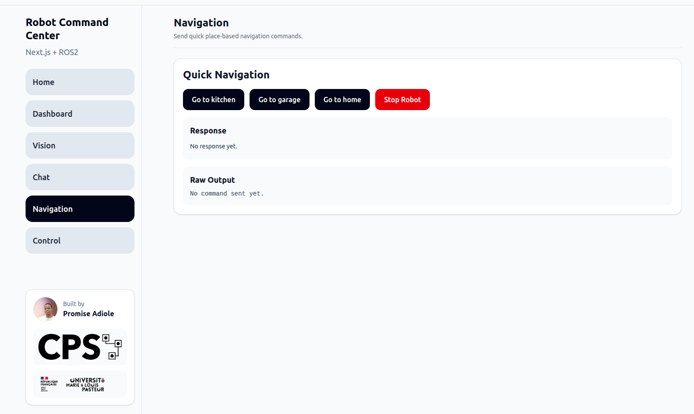
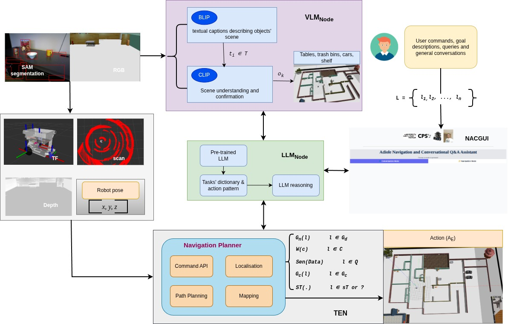
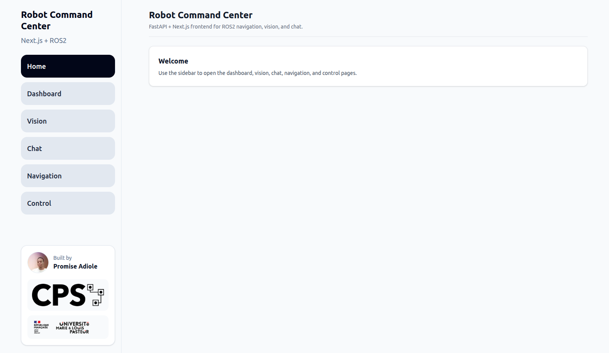
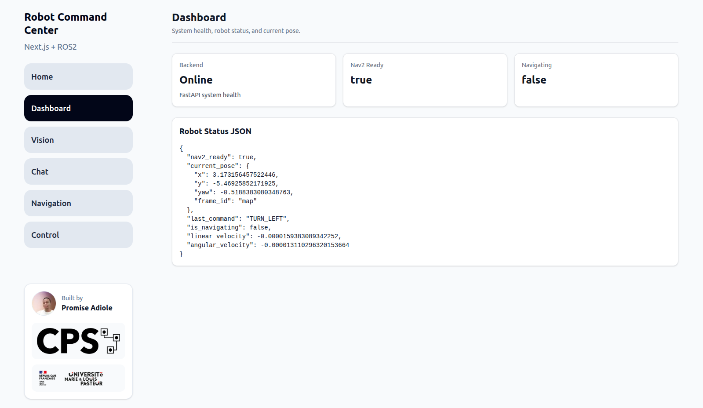
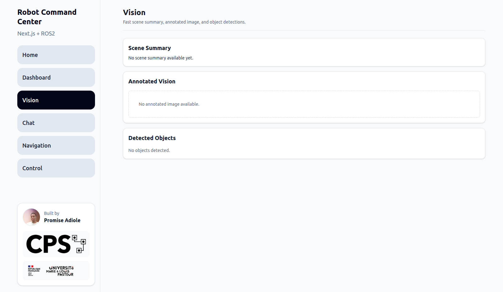
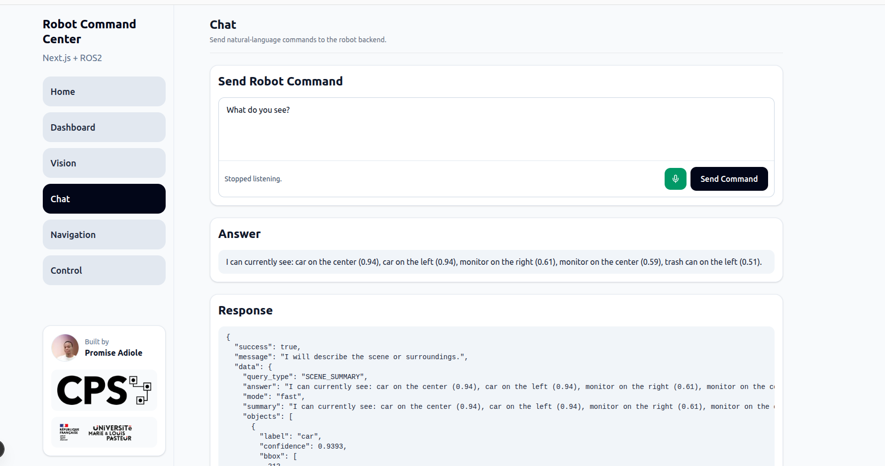
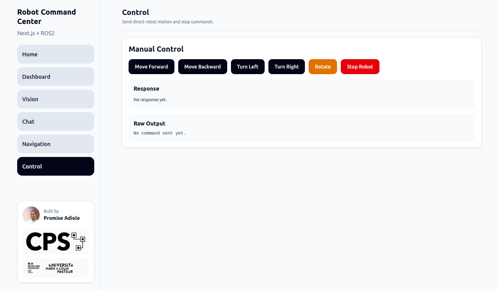
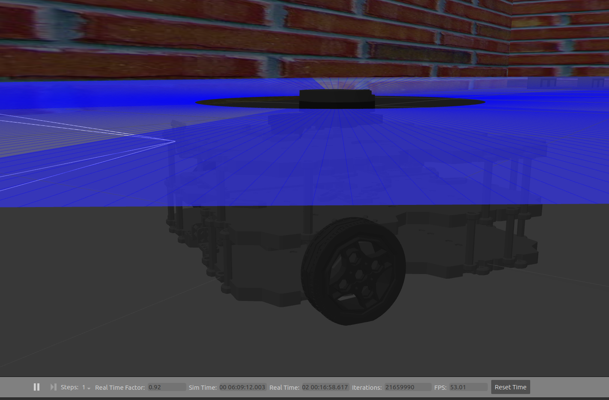
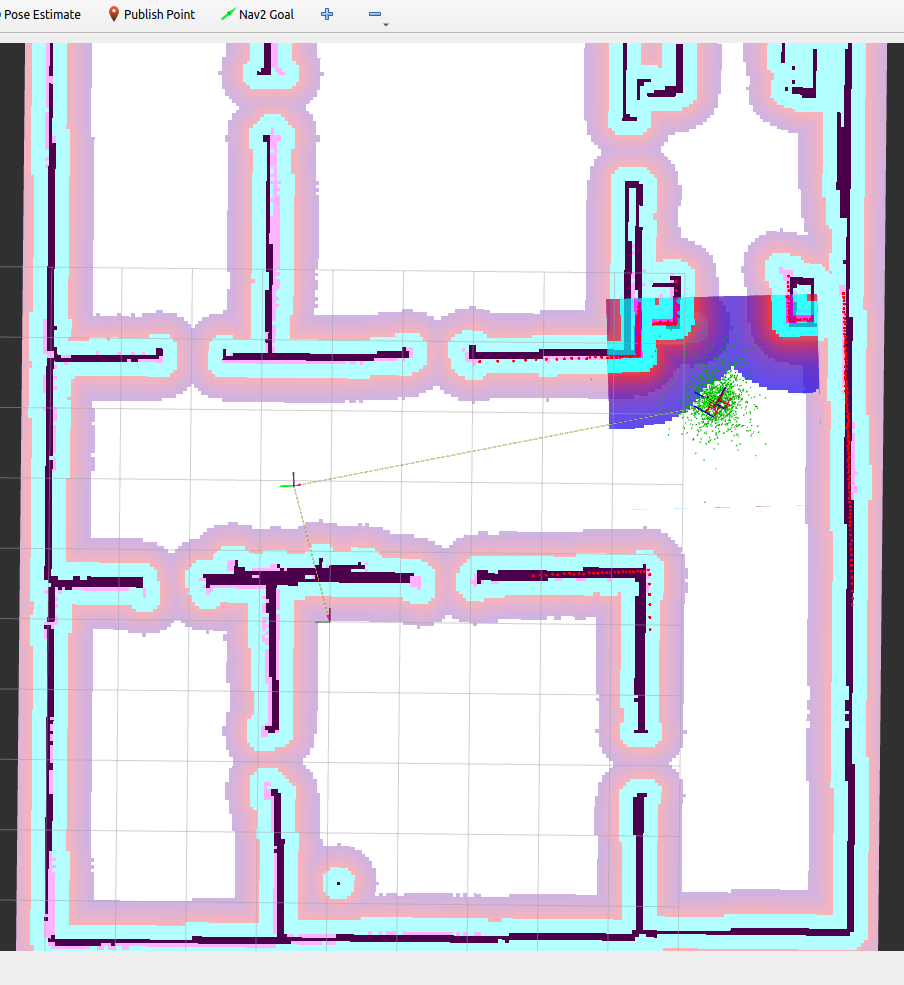
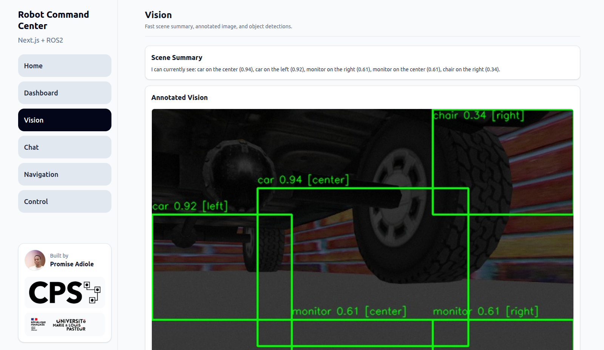

# 🤖 Language-Grounded Robot Autonomy

[](https://promzyadiole.github.io/Language-Grounded-Robot-Autonomy/demo/)

<p align="center">
  <strong><a href="https://promzyadiole.github.io/Language-Grounded-Robot-Autonomy/demo/">▶ Play Demo Video</a></strong>
</p>


<p align="center">
  <strong>A full-stack robot command framework that connects natural language, multimodal perception, ROS 2 navigation, speech input, and a modern web interface.</strong>
</p>

<p align="center">
  
  
  
  
  
  
</p>

---

## 📌 Overview

**Language-Grounded Robot Autonomy** is a modular robotics framework for controlling a mobile robot through **natural language**, **voice commands**, **multimodal scene understanding**, and **structured ROS 2 execution**.

The project combines:

- a **FastAPI backend** for robot control, perception services, intent handling, and state tracking
- a **Next.js frontend** for chat, navigation, control, dashboard, and vision monitoring
- a **ROS 2 bridge** that connects the web layer to live robot topics, actions, and sensors
- a **multimodal perception stack** for object detection, scene summarization, and annotated visual feedback
- a **state memory layer** for pose history, last command, previous pose, scan summaries, and execution context
- a **YAML-driven task registry** for configurable places, routes, and motion primitives
- **browser speech-to-text** for voice-driven interaction

This repository is designed to be both:
- a **research-engineering project** for language-grounded autonomy
- a **practical framework** that can be adapted to your own custom ROS 2 robot

---

## ✨ Core Features

### 🗣️ Natural Language Robot Commands
Users can send commands such as:

- `Go to the kitchen`
- `What do you see?`
- `Where are you?`
- `What was my last command?`
- `Move forward`
- `Turn right`
- `Stop`

The system parses user intent, maps it to safe execution primitives, and returns structured robot responses.

### 🎙️ Voice Command Support
The chat page supports browser-based speech input using the **Web Speech API**, enabling microphone-driven command entry directly from the UI.

### 👁️ Multimodal Perception
The robot can:
- summarize the scene
- list visible objects
- return annotated image overlays
- respond to perception-grounded language queries

### 🧭 Place-Based Navigation
Named destinations such as `kitchen`, `garage`, `parlour`, or `home` are stored in a YAML registry and mapped to navigation goals through ROS 2 Nav2.

### 🕹️ Manual Motion Control
The control page exposes direct robot actions such as:
- move forward
- move backward
- turn left
- turn right
- rotate
- stop

### 🧠 Robot State Memory
The backend stores:
- current pose
- previous pose
- last command
- last result
- event history
- scan summaries
- robot status snapshots

This allows the robot to answer state-aware questions instead of behaving like a stateless command parser.

### 🌐 Full Web Command Center
The UI includes dedicated pages for:
- Home
- Dashboard
- Vision
- Chat
- Navigation
- Control

### ⚙️ ROS 2 Integration
The system integrates directly with ROS 2 topics, Nav2 actions, camera feeds, scan data, localization, and motion publishing.

---

## 🏗️ System Architecture

<p align="center">
  
</p>

### High-Level Flow

```text
User (Text / Voice / Buttons)
        ↓
Next.js Frontend
        ↓
FastAPI Backend
        ↓
Intent Parsing + Action Mapping + State Memory
        ↓
ROS2 Bridge + Vision Service + YAML Registry
        ↓
Nav2 / Topics / Sensors / Robot Execution
```

### Main Architectural Layers

The system is organized into four major layers. Each layer has a clear responsibility and communicates with the next layer through structured data, REST APIs, ROS 2 interfaces, or shared robot state.

#### 1. Interaction Layer

The interaction layer is the user-facing part of the system. It provides a clean web command center for issuing commands, monitoring robot state, viewing perception results, and interacting through chat or voice.

It includes:

- text-based chat commands
- browser speech-to-text input
- quick command buttons
- navigation controls
- manual motion controls
- dashboard status cards
- vision monitoring panels

#### 2. Language Layer

The language layer converts natural user instructions into structured robot intents.

Example user commands include:

```text
Go to the kitchen
What do you see?
Where are you?
Move forward
Stop
```

These commands are interpreted as robot-safe actions such as:

- `NAVIGATE_TO_PLACE`
- `MOVE_FORWARD`
- `TURN_LEFT`
- `SCENE_SUMMARY`
- `GET_ROBOT_STATUS`
- `GET_CURRENT_POSE`
- `GET_LAST_COMMAND`

#### 3. Perception Layer

The perception layer connects the robot’s camera stream to multimodal understanding modules.

It supports:

- object detection
- scene summarization
- annotated image generation
- object position hints such as left, center, and right
- perception-grounded robot responses

This allows the robot to answer questions such as:

```text
What do you see?
Is there anything in front of you?
List visible objects
Describe the scene
```

#### 4. Execution Layer

The execution layer connects interpreted commands to ROS 2 execution.

It converts structured backend actions into:

- Nav2 navigation goals
- named waypoint navigation
- route execution
- `/cmd_vel` velocity commands
- robot stop commands
- scan summaries
- pose queries
- camera capture requests
- robot state updates

This layer is responsible for safely bridging the web application and the live robot system.

---

## 🧱 Tech Stack

### Robotics

- **ROS 2 Humble**
- **Nav2**
- **Gazebo**
- **AMCL**
- **TurtleBot3**

### Backend

- **FastAPI**
- **Python**
- **Pydantic**
- **Uvicorn**

### Frontend

- **Next.js**
- **TypeScript**
- **React**
- **Tailwind CSS**

### Vision / Multimodal AI

- **Segment Anything Model**
- **CLIP / OpenCLIP**
- **OpenCV**
- **NumPy**

### Interaction

- **Web Speech API**
- **REST API**
- **JSON-based command and response flow**

### Configuration and State

- **YAML action registry**
- **State memory store**
- **Typed schemas**
- **Robot event history**

---

## 📂 Project Structure

```text
Language-Grounded-Robot-Autonomy/
├── backend/
│   ├── app/
│   │   ├── main.py
│   │   ├── api/
│   │   │   └── routes/
│   │   │       ├── chat.py
│   │   │       ├── memory.py
│   │   │       ├── navigation.py
│   │   │       ├── robot.py
│   │   │       ├── system.py
│   │   │       └── vision.py
│   │   ├── core/
│   │   │   ├── config.py
│   │   │   └── dependencies.py
│   │   ├── models/
│   │   │   └── schemas.py
│   │   ├── services/
│   │   │   ├── action_mapper.py
│   │   │   ├── intent_parser.py
│   │   │   ├── llm_service.py
│   │   │   ├── ros2_bridge.py
│   │   │   ├── sam_clip_perceptor.py
│   │   │   ├── state_store.py
│   │   │   ├── vision_service.py
│   │   │   └── yaml_registry.py
│   │   └── data/
│   │       └── robot_actions.yaml
│   │
│   └── requirements.txt
│
├── frontend/
│   ├── public/
│   ├── src/
│   │   ├── app/
│   │   │   ├── chat/
│   │   │   ├── control/
│   │   │   ├── dashboard/
│   │   │   ├── navigation/
│   │   │   ├── vision/
│   │   │   ├── globals.css
│   │   │   ├── layout.tsx
│   │   │   └── page.tsx
│   │   ├── components/
│   │   │   ├── chat-panel.tsx
│   │   │   ├── command-buttons.tsx
│   │   │   ├── sidebar.tsx
│   │   │   ├── status-card.tsx
│   │   │   ├── topbar.tsx
│   │   │   └── vision-panel.tsx
│   │   └── lib/
│   │       └── api.ts
│   │
│   ├── package.json
│   └── next.config.ts
│
├── docs/
│   └── images/
│       ├── hero-ui-overview.png
│       ├── architecture-overview.png
│       ├── ui-home-page.png
│       ├── ui-dashboard-page.png
│       ├── ui-vision-page.png
│       ├── ui-chat-page.png
│       ├── ui-navigation-page.png
│       ├── ui-control-page.png
│       ├── robot-gazebo-overview.png
│       ├── robot-rviz-overview.png
│       ├── robot-annotated-vision.png
│       └── workflow-chat-to-ros2.png
│
├── README.md
└── .gitignore
```

---

## 🧠 How the Framework Works

The framework follows a structured command-processing pipeline from the web interface to ROS 2 execution.

```text
User Command
    ↓
Frontend Request
    ↓
FastAPI Backend
    ↓
Intent Parser
    ↓
Action Mapper
    ↓
YAML Registry / State Store
    ↓
ROS 2 Bridge
    ↓
Nav2 / Topics / Sensors
    ↓
Robot Response
    ↓
Frontend Feedback
```

### 1. User Sends a Command

The user can interact with the robot through:

- typed text on the chat page
- voice input through the microphone
- quick command buttons
- navigation page controls
- manual motion controls

### 2. Frontend Calls the Backend

The frontend sends structured REST requests to the FastAPI backend.

Example endpoints include:

```text
POST /api/chat/command
POST /api/navigation/go-to
POST /api/robot/stop
GET  /api/vision/scene-summary-fast
```

### 3. Backend Parses Intent

The backend classifies the user command into a structured robot intent.

Example intents include:

```text
NAVIGATE_TO_PLACE
MOVE_FORWARD
MOVE_BACKWARD
TURN_LEFT
TURN_RIGHT
SCENE_SUMMARY
GET_POSE
GET_LAST_COMMAND
STOP_ROBOT
```

### 4. Action Mapper Grounds the Request

The action mapper connects the interpreted intent to known robot capabilities.

It checks:

- named places
- route definitions
- motion primitives
- aliases
- supported robot queries
- state-aware commands

### 5. ROS 2 Bridge Executes the Action

The ROS 2 bridge converts backend actions into robot-level execution.

It can interact with:

- Nav2 action goals
- waypoint routes
- velocity commands
- scan summaries
- pose estimates
- camera data
- robot status topics

### 6. State Store Updates Robot Memory

The state store records useful execution context such as:

- current pose
- previous pose
- last command
- last result
- robot status
- scan summary
- event history

This gives the robot short-term memory and allows it to answer context-aware questions.

### 7. Frontend Displays Structured Feedback

The frontend displays:

- human-readable robot response
- raw JSON response
- robot status
- perception results
- annotated vision output
- navigation feedback
- command execution result

---

## 🔌 Main API Routes

### System

```http
GET /api/system/health
```

Used to check whether the backend is running.

### Robot

```http
GET  /api/robot/status
GET  /api/robot/scan-summary
POST /api/robot/stop
POST /api/robot/capture
```

Used for robot status, scan data, emergency stop, and camera capture.

### Navigation

```http
POST /api/navigation/go-to
POST /api/navigation/follow-route
```

Used for semantic place-based navigation and route execution.

### Vision

```http
GET /api/vision/scene-summary-fast
GET /api/vision/objects-fast
GET /api/vision/objects-fast-annotated
```

Used for scene understanding, object detection, and annotated perception output.

### Chat

```http
POST /api/chat/command
```

Used for natural language robot commands.

### Memory

```http
GET /api/memory/summary
GET /api/memory/pose-history
GET /api/memory/event-history
```

Used for retrieving stored robot state, pose history, and event history.

---

## 💬 Example Commands

### Navigation

```text
Go to the kitchen
Go to the garage
Go to home
Start patrol route
Navigate to the parlour
```

### Motion

```text
Move forward
Move backward
Turn left
Turn right
Rotate
Stop
```

### Perception

```text
What do you see?
List visible objects
Describe the scene
Capture image
Is there an obstacle ahead?
```

### State Queries

```text
Where are you?
What was your last command?
What was your previous position?
What is your status?
Show me your pose history
```

---

## 🗺️ YAML-Driven Robot Grounding

The framework uses a YAML registry to define robot-understandable environment concepts.

Instead of hardcoding every destination or movement inside Python logic, the robot can be configured through a simple YAML file.

### Example YAML Registry

```yaml
places:
  kitchen:
    aliases:
      - kitchen
      - cooking area
    pose:
      x: -4.0
      y: 3.0
      yaw: 3.14

  garage:
    aliases:
      - garage
      - parking area
    pose:
      x: 3.2
      y: -5.5
      yaw: -1.57

motions:
  move_forward:
    aliases:
      - move forward
      - forward
      - go forward
    cmd_vel:
      linear_x: 0.20
      angular_z: 0.0
      duration_sec: 2.0

  turn_left:
    aliases:
      - turn left
      - rotate left
    cmd_vel:
      linear_x: 0.0
      angular_z: 0.40
      duration_sec: 1.5
```

### Why YAML Grounding Matters

This design makes the robot easier to adapt because you can:

- change named places without editing backend logic
- define new destinations for a new map
- add synonyms for natural user commands
- customize motion primitives for different robots
- define routes for patrol or inspection tasks
- separate robot configuration from application code

---

## 🧪 Vision Capabilities

The perception stack supports fast visual understanding from robot camera data.

It can return:

- detected objects
- confidence scores
- bounding boxes
- object direction hints
- scene summaries
- annotated image outputs

### Example Scene Summary

```json
{
  "mode": "fast",
  "summary": "I can currently see: door on the left (0.75), table in the center (0.61), cabinet on the right (0.51)."
}
```

### Example Object Detection Response

```json
{
  "label": "table",
  "confidence": 0.643,
  "bbox": [0, 320, 212, 480],
  "direction": "left"
}
```

---

## 🧭 Navigation and Control Design

The project separates high-level navigation from low-level control.

### Navigation Page

The navigation page is used for semantic robot movement.

It supports:

- place-based movement
- route execution
- named destination selection
- semantic goal commands

Example:

```text
Go to the kitchen
```

This type of command is resolved into a known pose and sent to the Nav2 navigation stack.

### Control Page

The control page is used for direct robot motion.

It supports:

- move forward
- move backward
- turn left
- turn right
- rotate
- stop

This separation improves:

- safety
- interface clarity
- operator understanding
- debugging
- future system extension

---

## 🎤 Voice Command Support

The chat interface includes microphone support using the browser’s speech recognition capability.

### Current Voice Flow

```text
Microphone Button
    ↓
Browser Speech Recognition
    ↓
Text Transcription
    ↓
Chat Input
    ↓
FastAPI Command Request
    ↓
Robot Response
```

### Current Behavior

- click the microphone button
- speak a robot command
- transcription is inserted into the chat input
- submit the recognized command to the backend
- receive a structured robot response

### Notes

- best supported in Chromium-based browsers
- requires browser microphone permission
- transcription quality depends on the microphone and browser speech engine
- voice input is currently used as a command-entry method, not as a full dialogue engine

---

## 📸 Suggested README Image Plan

Create the following image files and place them inside:

```text
docs/images/
```

### UI Images

| File Name | Purpose |
|---|---|
| `hero-ui-overview.png` | Full application screenshot showing sidebar and one main page |
| `ui-home-page.png` | Home page screenshot |
| `ui-dashboard-page.png` | Dashboard page with robot status cards |
| `ui-vision-page.png` | Vision page showing scene summary and annotated image |
| `ui-chat-page.png` | Chat page with command, answer, and response sections |
| `ui-navigation-page.png` | Navigation page with quick destination buttons |
| `ui-control-page.png` | Control page with manual motion commands |

### Robot / Simulation Images

| File Name | Purpose |
|---|---|
| `robot-gazebo-overview.png` | Robot inside the Gazebo simulation world |
| `robot-rviz-overview.png` | RViz screenshot showing localization, map, and navigation |
| `robot-annotated-vision.png` | Annotated camera result from the perception pipeline |

### Architecture / Workflow Images

| File Name | Purpose |
|---|---|
| `architecture-overview.png` | Full system architecture diagram |
| `workflow-chat-to-ros2.png` | Command flow diagram from UI to ROS 2 execution |

---

## 🖼️ UI Preview

### Home

<p align="center">
  
</p>

### Dashboard

<p align="center">
  
</p>

### Vision

<p align="center">
  
</p>

### Chat

<p align="center">
  
</p>

### Navigation

<p align="center">
  
</p>

### Control

<p align="center">
  
</p>

---

## 🤖 Robot and Perception Preview

### Gazebo Simulation

<p align="center">
  
</p>

### RViz

<p align="center">
  
</p>

### Annotated Vision Output

<p align="center">
  
</p>

---

## 🚀 Getting Started

### 1. Clone the Repository

```bash
git clone git@github.com:promzyadiole/Language-Grounded-Robot-Autonomy.git
cd Language-Grounded-Robot-Autonomy
```

### 2. Backend Setup

```bash
cd backend
python -m venv .venv
source .venv/bin/activate
pip install -r requirements.txt
python -m uvicorn app.main:app --reload
```

The backend runs at:

```text
http://127.0.0.1:8000
```

### 3. Frontend Setup

Open a second terminal:

```bash
cd frontend
npm install
npm run dev
```

The frontend runs at:

```text
http://localhost:3000
```

### 4. Launch ROS 2 / Gazebo / Nav2

Start your robot simulation or real robot stack separately.

Make sure the following are available:

- localization pose source
- camera topic
- laser scan topic
- Nav2 action server
- `/cmd_vel` publishing path
- robot map and transform tree

---

## 🛠️ Adapting This Framework to Your Own Robot

This project is intentionally built to be portable.

To connect your own robot, update the robot-specific integration points below.

### 1. Update ROS Topic and Action Names

Modify:

```text
backend/app/services/ros2_bridge.py
```

Update the bridge to match your robot’s:

- odometry topic
- scan topic
- image topic
- camera info topic
- localization topic
- navigation action interface
- motion command topic

### 2. Update YAML Places and Routes

Edit:

```text
backend/app/data/robot_actions.yaml
```

Define:

- named locations
- aliases users may say
- route sequences
- direct motion primitives
- environment-specific commands

### 3. Ensure Localization Is Available

The robot should publish a pose source such as:

```text
/amcl_pose
```

or another localization estimate used by your own robot stack.

### 4. Make Sure Navigation Is Reachable

For semantic navigation commands, your robot needs:

- Nav2 or an equivalent goal interface
- valid global and local planners
- correct map frame setup
- working transform tree
- reachable goal poses

### 5. Confirm Perception Topics

Your robot must publish camera data compatible with the backend vision service.

Typical camera inputs include:

- RGB image topic
- camera info topic
- optional depth image topic

### 6. Test Incrementally

Recommended testing order:

1. system health
2. robot status
3. stop command
4. motion command
5. navigation command
6. scene summary
7. annotated vision
8. chat command
9. voice command

---

## 📈 Why This Project Matters

This repository is more than a web UI around ROS topics.

It demonstrates how to build a robot system that is:

- language-grounded
- perception-aware
- stateful
- web-accessible
- operator-friendly
- portable to custom robots
- research-relevant
- engineering-ready

It serves as a strong foundation for:

- thesis work
- human-robot interaction demos
- embodied AI prototypes
- multimodal robotics research
- deployable command-center interfaces
- AI/robotics interview demonstrations

---

## 🧩 Current Capabilities Summary

- ✅ Text-based robot commands
- ✅ Voice command input
- ✅ FastAPI control backend
- ✅ Next.js command center frontend
- ✅ ROS 2 bridge integration
- ✅ Nav2 place-based navigation
- ✅ Manual motion primitives
- ✅ Scene summary
- ✅ Object detection
- ✅ Annotated perception outputs
- ✅ Robot state memory
- ✅ YAML-based grounding
- ✅ Status queries
- ✅ Pose queries
- ✅ Event history queries

---

## 🔮 Planned Improvements

- retrieval-augmented robot memory
- richer long-horizon task planning
- stronger multimodal reasoning
- real-world hardware deployment
- authentication and remote access
- trajectory history visualization
- map-aware semantic navigation
- mission logs and replay tools
- multi-robot support
- improved speech dialogue loop
- richer failure recovery behavior

---

## 📚 Research Context

This project is aligned with research directions in:

- language-grounded human-robot interaction
- large language models for robotics
- multimodal perception for embodied agents
- explainable robot command systems
- full-stack interfaces for autonomous systems
- language-conditioned navigation
- semantic robot task execution

It draws inspiration from work in:

- ReLI
- Code as Policies
- ProgPrompt
- CLIP
- SAM
- ROS 2
- Nav2
- embodied AI systems

---

## 👤 Author

**Promzy Adiole**

Built as part of a broader research and engineering effort in language-grounded robot autonomy, combining robotics, web systems, multimodal AI, and human-robot interaction.

---

## 📄 License

Add your preferred license here.

Example:

```text
MIT License
```

---

## 🙌 Acknowledgments

Special thanks to:

- academic supervisors and research mentors
- the ROS 2 and Nav2 communities
- the open-source computer vision community
- the multimodal AI ecosystem
- the broader robotics research community advancing language-grounded autonomy

---

## ⭐ Repository Tip

If this project helps your work, consider starring the repository and referencing it in your academic, research, or engineering portfolio.

<p align="center">
  <strong>Language • Perception • Navigation • Interaction • Autonomy</strong>
</p>